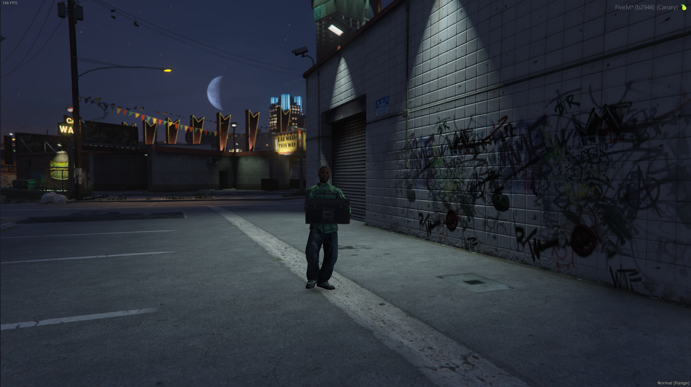

# INTRODUCTION
This script is made for mx-surround. With this script you can create a boombox and play real-time surround sound.

# INSTALLATION
1. Download the zip file from the [download](https://github.com/MOXHARTZ/mx-boombox/archive/refs/heads/main.zip)
2. Extract the zip file
3. Rename the folder to `mx-boombox` (Be sure to remove the `-main` from the folder name)
4. Copy the folder to your `resources` folder

# SCREENSHOTS

# REQUIREMENTS
- [mx-surround](https://mxstore.tebex.io/package/5864855)
- [mx-audioplayer](https://github.com/MOXHARTZ/mx-audioplayer)

# Other official addon scripts
- [mx-audioplayer](https://github.com/MOXHARTZ/mx-audioplayer)
- [mx-caradio](https://github.com/MOXHARTZ/mx-caradio)